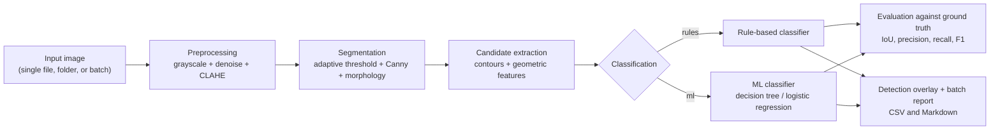

**English** | [Português](README.pt-BR.md)

# inspecao-visual-superficie

Computer vision pipeline to detect and classify defects (scratches, corrosion,
missing rivet holes) on metal surface images.


## The problem

On most production lines, surface visual inspection is still done by a human
inspector eyeballing each part under controlled lighting. It's slow, expensive
at scale, and prone to fatigue: after hours of repeating the same task,
attention drops and small defects slip through. In the aerospace industry this
matters more than in almost any other sector — an undetected surface scratch
on a structural panel, or a rivet that should be there and isn't, is the kind
of thing that connects directly to fatigue cracking and structural integrity.
Automating the first pass doesn't replace the inspector, but it gives them a
consistent pre-screening that doesn't get tired and points out exactly where
to look more closely.

This project is my attempt to study that problem with the same computer
vision techniques I use in a different context (embedded vision for drones,
closed-source code from the team I'm part of), applied from scratch to a
different domain and with my own dataset.

## Pipeline



## Installation

```bash
python3 -m venv .venv
source .venv/bin/activate
pip install -r requirements.txt
pip install -e .
```

## Usage

Every command below has been tested end to end in this repository.

```bash
# generate a synthetic training dataset (images + ground truth in JSON)
inspecao gerar-dataset --n-imagens 60 --seed 42

# generate a separate dataset the model never sees, for an honest evaluation
inspecao gerar-dataset --n-imagens 40 --seed 999 \
    --saida-imagens dados/teste_imagens --saida-gt dados/teste_gt

# train the ML baseline on the training dataset
inspecao treinar-ml --tipo-modelo arvore

# run the full pipeline on a folder of images, produce overlays and a batch report
inspecao inspecionar dados/teste_imagens --classificador ml --modelo-ml dados/modelo_ml.pkl

# evaluate rules and ML against the test dataset's ground truth
inspecao avaliar --dataset-imagens dados/teste_imagens --dataset-gt dados/teste_gt \
    --modelo-ml dados/modelo_ml.pkl

# measure time per pipeline stage
inspecao benchmark dados/teste_imagens --n-imagens 40
```

The CLI itself is in Portuguese (subcommands, flags, config keys) since that's
the language I wrote and tested this project in — the commands above are
copy-pasteable as-is. Default configuration (segmentation thresholds,
rule-classifier limits, severity cutoffs, etc.) lives in `config.yaml`. Every
CLI argument overrides the corresponding value from the file.

## Rules vs. machine learning

Both approaches were evaluated on the same test set (`seed=999`, 40 images,
**never used to train the ML model**) — an honest comparison, no data leakage:

| class | Precision (rules) | Recall (rules) | F1 (rules) | Precision (ML) | Recall (ML) | F1 (ML) |
|---|---|---|---|---|---|---|
| furo_ausente | 0.806 | 0.962 | 0.877 | 0.962 | 0.962 | 0.962 |
| mancha | 0.512 | 0.733 | 0.603 | 0.683 | 0.933 | 0.789 |
| risco | 0.593 | 0.593 | 0.593 | 0.735 | 0.926 | 0.820 |
| mean IoU | 0.853 | | | 0.853 | | |

(full table, including the confusion matrix, in `avaliacao/resultados.md`)

The rule-based classifier does well on `furo_ausente` (missing rivet hole) —
it's the most constrained shape (round, solid, small) and the geometric rule
I wrote for it captures that almost perfectly. Where it struggles is telling
`risco` (scratch) apart from `mancha` (corrosion stain): the rule uses the
bounding-box aspect ratio to spot scratches, but a scratch drawn close to 45°
has a nearly square bounding box — aspect ratio close to 1, same as a small
stain. In my synthetic data this happens for more than half the scratches
(the angle is sampled uniformly). The ML classifier uses all six features
jointly instead of applying fixed thresholds one at a time, and that's exactly
where it wins: scratch recall goes from 0.593 to 0.926. Mean IoU is identical
between the two approaches because localization (segmentation + contour) is
the same in both cases — only the label assigned to each candidate changes.

## Before and after

| Original | With detection overlay |
|---|---|
|  |  |

Blue = furo_ausente (missing rivet hole), orange = risco (scratch), red =
mancha (corrosion stain). The pixel area comes directly from the detected
contour, not an estimate.

## Error analysis

`mancha` has the lowest precision of the three classes (0.683 with ML, 0.512
with rules — see the table above). Below are two real failures pulled
straight from the evaluation run on the test set (`seed=999`), not staged for
the screenshot. The dashed magenta outline marks the defect or detection
involved in the error; the `FP`/`FN` tag identifies which one it is.

**False positive** — `dados/teste_imagens/img_0034.png`, ML classifier:


*Segmentation split one real stain into two pieces. The top one became the
correct detection; the bottom one was left over as a fragment with no real
defect of its own.*

**False negative** — `dados/teste_imagens/img_0013.png`, ML classifier:


*A real 2983px stain that segmentation fragmented into small pieces, each
classified individually; no fragment reached IoU >= 0.3 against the real
defect, so the whole defect ended up undetected.*

Both cases share the same root cause: fragmentation in the segmentation
step, not a classifier mistake. That's exactly what motivates the first item
in "Limitations and next steps" right below — a binary "is this a defect or
not" rejection step before per-type classification would help filter these
fragments out before they turn into a false positive or keep the whole
defect from being recognized as one region.

## Performance

Measured with `inspecao benchmark`, averaged over 40 images at 640x480,
single-threaded (no parallelism across images):

| stage | average time |
|---|---|
| preprocessing | 0.81 ms |
| segmentation | 3.82 ms |
| feature extraction | 0.87 ms |
| **total** | **5.51 ms/image** |

Approximate throughput: **~180 images/s** on one core.

Hardware used: AMD Ryzen 7 7735HS (desktop/laptop, x86_64), Ubuntu 22.04,
Python 3.10. I haven't tested this on real embedded hardware (see
limitations below), but the dominant cost is segmentation (adaptiveThreshold
+ Canny + morphology, all O(n) operations on the image), so the order of
magnitude should hold reasonably well even on a core much weaker than a
notebook Ryzen.

## Limitations and next steps

- **The dataset is synthetic.** Real-world defects have texture, lighting,
  and shape variability my generator doesn't model: real corrosion isn't a
  set of overlapping circles, a real scratch doesn't have constant thickness
  along its length. The precision/recall numbers here measure the pipeline
  against the distribution I designed myself, not against real-world
  variability.
- **Segmentation still produces a fair amount of background noise.** Even
  after calibrating the adaptive threshold parameters (see the comment in
  `segmentacao.py`), on average there are more candidates per image than
  actual defects, which drags down precision for both classifiers. A binary
  "is this a defect or not" rejection step before per-type classification
  would probably help more than any amount of fine-tuning on the two current
  classifiers.
- **Near-diagonal scratches confuse both approaches**, the rule-based one
  more than the ML one (see the section above). Adding a rotation-invariant
  feature (for example, the axis ratio of an ellipse fitted to the contour,
  instead of the bounding-box aspect ratio) is the obvious next step for the
  rule-based classifier.
- I haven't tested this on real embedded hardware (Raspberry Pi, Jetson,
  etc.), only extrapolated from the desktop benchmark.
- The dataset generator doesn't check for overlap between defects in the
  same image (see the TODO in `dataset.py`).

## What I learned

Writing the synthetic generator was the part that taught me something I
didn't expect: almost none of the project's calibration time went into
tuning the classifier — it went into tuning segmentation so it wouldn't
return the entire background texture as a "defect candidate." With a low
`threshold_c` (the "textbook" value from OpenCV's docs), the binary mask came
out with more than 20% of the image white, pure texture from the synthetic
plate. That left me a lot more skeptical of computer vision tutorials that
only show results on one "pretty" image — behavior on real background noise
(or, in my case, synthetic texture noise) is what decides whether the whole
pipeline is actually usable.

The other thing that became clear comparing rules and ML side by side:
geometric rules are interpretable and easy to justify (you can explain in one
sentence why something was classified as a hole), but every new rule added to
cover an edge case increases the odds of breaking another case that already
worked. The ML classifier doesn't need that juggling because it learns the
decision boundary across all six dimensions at once — the price is that the
learned boundary doesn't fit in one sentence.

## Disclaimer

Detailed technical documentation of every non-obvious pipeline decision (what
CLAHE is, the difference between global and adaptive thresholding, what
morphological opening and closing do, how IoU is computed, why a false
negative costs more than a false positive in a safety-inspection scenario) is
in [`ESTUDO.md`](ESTUDO.md) *(Portuguese only)*.
