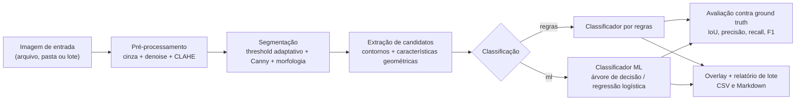
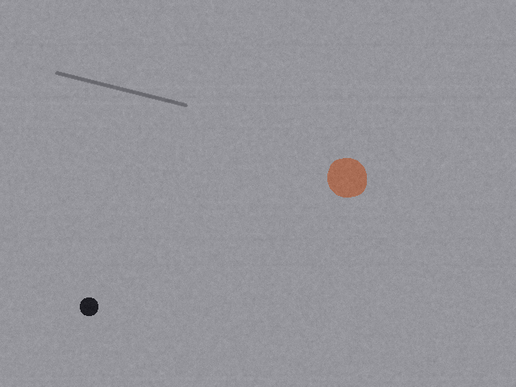
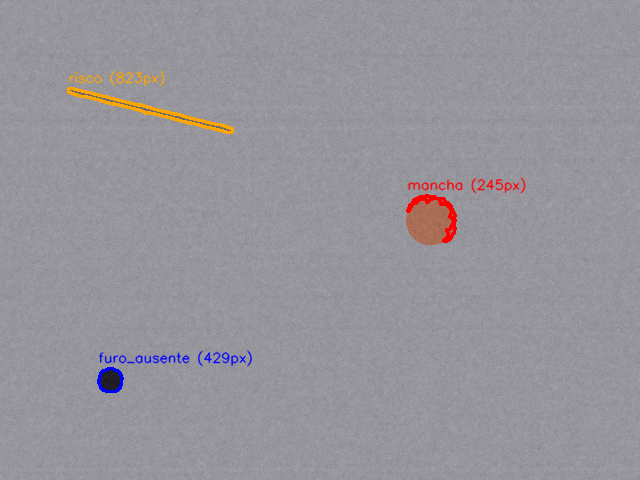
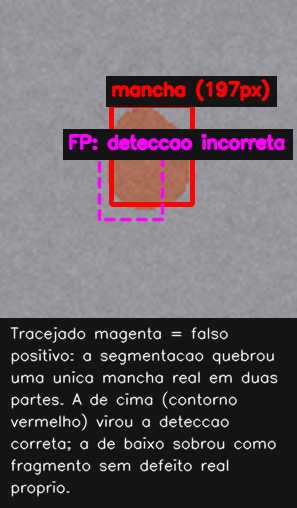
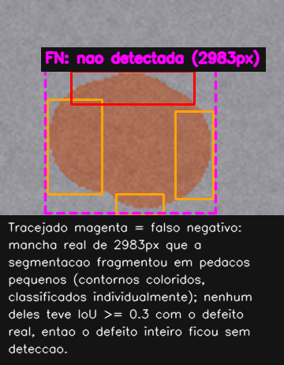

[English](README.md) | **Português**

# inspecao-visual-superficie

Pipeline de visão computacional para detectar e classificar defeitos (riscos,
corrosão, furos de rebite ausentes) em imagens de superfícies metálicas.


## O problema

Inspeção visual de superfície é, na maioria das linhas de produção, ainda
feita por um inspetor humano passando os olhos em cada peça sob luz
controlada. É lento, caro em escala e sujeito a fadiga: depois de horas
repetindo a mesma tarefa, a atenção cai e defeitos pequenos passam. Na
indústria aeronáutica isso pesa mais que em quase qualquer outro setor —
um risco superficial não detectado numa chapa estrutural, ou um rebite que
deveria estar lá e não está, é o tipo de coisa que se conecta direto a
fadiga de material e integridade estrutural. Automatizar a primeira triagem
não substitui o inspetor, mas dá a ele uma pré-seleção consistente, que não
cansa e que sinaliza exatamente onde olhar com mais atenção.

Este projeto é a minha tentativa de estudar esse problema com as mesmas
técnicas de visão computacional que uso em outro contexto (visão embarcada
para drones, código fechado da equipe onde participo), aplicadas do zero a
um domínio diferente e com dataset próprio.

## Pipeline



## Instalação

```bash
python3 -m venv .venv
source .venv/bin/activate
pip install -r requirements.txt
pip install -e .
```

## Uso

Todos os comandos abaixo foram testados de ponta a ponta neste repositório.

```bash
# gera um dataset sintético de treino (imagens + ground truth em JSON)
inspecao gerar-dataset --n-imagens 60 --seed 42

# gera um dataset separado, nunca visto pelo modelo, só pra avaliação honesta
inspecao gerar-dataset --n-imagens 40 --seed 999 \
    --saida-imagens dados/teste_imagens --saida-gt dados/teste_gt

# treina o baseline de ML sobre o dataset de treino
inspecao treinar-ml --tipo-modelo arvore

# roda o pipeline completo numa pasta de imagens, gera overlay e relatório de lote
inspecao inspecionar dados/teste_imagens --classificador ml --modelo-ml dados/modelo_ml.pkl

# avalia regras e ML contra o ground truth do dataset de teste
inspecao avaliar --dataset-imagens dados/teste_imagens --dataset-gt dados/teste_gt \
    --modelo-ml dados/modelo_ml.pkl

# mede tempo por estágio do pipeline
inspecao benchmark dados/teste_imagens --n-imagens 40
```

A configuração default (thresholds de segmentação, limiares do classificador
por regras, limites de severidade etc.) fica em `config.yaml`. Todo argumento
de linha de comando sobrescreve o valor correspondente do arquivo.

## Regras vs. machine learning

As duas abordagens foram avaliadas no mesmo conjunto de teste (`seed=999`,
40 imagens, **nunca usado no treino do modelo de ML**) — comparação honesta,
sem vazamento de dados:

| classe | Precisão (regras) | Recall (regras) | F1 (regras) | Precisão (ML) | Recall (ML) | F1 (ML) |
|---|---|---|---|---|---|---|
| furo_ausente | 0.806 | 0.962 | 0.877 | 0.962 | 0.962 | 0.962 |
| mancha | 0.512 | 0.733 | 0.603 | 0.683 | 0.933 | 0.789 |
| risco | 0.593 | 0.593 | 0.593 | 0.735 | 0.926 | 0.820 |
| IoU médio | 0.853 | | | 0.853 | | |

(tabela completa, incluindo matriz de confusão, em `avaliacao/resultados.md`)

O classificador por regras acerta bem `furo_ausente` — é a forma mais
restritiva (redondo, sólido e pequeno) e a regra geométrica que escrevi pra
ela captura isso quase perfeito. Onde ele apanha é separando `risco` de
`mancha`: a regra usa razão de aspecto da bounding box pra achar riscos, mas
um risco desenhado perto de 45° tem bbox quase quadrada — aspecto perto de 1,
igual a uma mancha pequena. Nos meus dados sintéticos isso acontece em mais
da metade dos riscos (ângulo é sorteado uniformemente). O classificador de ML
usa as seis características em conjunto em vez de aplicar limiares fixos um
de cada vez, e isso é exatamente onde ele ganha: recall de risco sobe de
0.593 pra 0.926. IoU médio é idêntico entre as duas abordagens porque a
localização (segmentação + contorno) é a mesma nos dois casos — só muda o
rótulo atribuído a cada candidato.

## Antes e depois

| Original | Com overlay de detecção |
|---|---|
|  |  |

Azul = furo_ausente, laranja = risco, vermelho = mancha. A área em pixels vem
direto do contorno detectado, não de uma estimativa.

## Análise de erro

`mancha` é a classe com pior precisão das três (0,683 com ML, 0,512 com
regras — ver tabela acima). Isso não é só número: abaixo estão dois erros
reais tirados direto da avaliação no conjunto de teste (`seed=999`), não
montados pra ilustração.

**Falso positivo** — `dados/teste_imagens/img_0034.png`, classificador ML:



A segmentação quebrou uma única mancha real em dois contornos separados. O
pedaço de cima (vermelho, sólido) bateu com o ground truth e virou a
detecção correta; o de baixo (magenta, tracejado) não tem ground truth
próprio e foi reportado como uma `mancha` extra que não existe. É o mesmo
problema de ruído de fundo citado nas limitações abaixo: mais candidatos por
imagem do que defeitos de verdade.

**Falso negativo** — `dados/teste_imagens/img_0013.png`, classificador ML:



Aqui a fragmentação foi mais longe: uma única mancha de 2983 px² se quebrou
em quatro pedaços pequenos e desconectados (caixas coloridas), nenhum deles
alcançando o limiar de IoU 0,3 contra a região inteira do ground truth. O
defeito está visualmente presente nas detecções, mas conta como totalmente
perdido porque a segmentação nunca reconstrói ele como um blob conectado só.

Mesma causa raiz nos dois lados — segmentação fragmentando a região do
defeito em vez de devolver um contorno só — e é exatamente por isso que o
ajuste proposto nas limitações mira a segmentação, não os classificadores.

## Desempenho

Medido com `inspecao benchmark`, média sobre 40 imagens de 640x480,
execução single-thread (sem paralelismo entre imagens):

| estágio | tempo médio |
|---|---|
| pré-processamento | 0.81 ms |
| segmentação | 3.82 ms |
| extração de características | 0.87 ms |
| **total** | **5.51 ms/imagem** |

Throughput aproximado: **~180 imagens/s** num núcleo.

Hardware usado: AMD Ryzen 7 7735HS (desktop/notebook, x86_64), Ubuntu 22.04,
Python 3.10. Não testei em hardware embarcado de verdade (ver limitações
abaixo), mas o custo dominante é a segmentação (adaptiveThreshold + Canny +
morfologia, todas operações O(n) na imagem), então a ordem de grandeza deve
se manter razoável mesmo num núcleo bem mais fraco que um Ryzen de notebook.

## Limitações e próximos passos

- **Dataset é sintético.** Defeito real tem variabilidade de textura,
  iluminação e forma que meu gerador não modela: corrosão real não é um
  conjunto de círculos sobrepostos, risco real não tem espessura constante
  ao longo do comprimento. Os números de precisão/recall aqui medem o
  pipeline contra a distribuição que eu mesma desenhei, não contra a
  variabilidade do mundo real.
- **Segmentação ainda gera bastante ruído de fundo.** Mesmo depois de
  calibrar os parâmetros do threshold adaptativo (ver comentário em
  `segmentacao.py`), sobra em média mais candidatos por imagem do que
  defeitos de verdade, o que derruba a precisão de ambos os classificadores.
  Um passo de rejeição binária "é defeito ou não" antes da classificação por
  tipo provavelmente ajudaria mais que qualquer ajuste fino nos dois
  classificadores atuais.
- **Riscos quase-diagonais confundem as duas abordagens**, o classificador
  de regras mais que o de ML (ver seção acima). Adicionar uma característica
  invariante a rotação (por exemplo, razão de eixos de uma elipse ajustada
  ao contorno, em vez do aspecto da bounding box) é o próximo passo óbvio
  pro classificador por regras.
- Não testei em hardware embarcado real (Raspberry Pi, Jetson etc.), só
  estimei a partir do benchmark em desktop.
- O gerador de dataset não verifica sobreposição entre defeitos na mesma
  imagem (ver TODO em `dataset.py`).

## O que aprendi

Escrever o gerador sintético foi a parte que mais me ensinou algo que eu não
esperava: quase todo o tempo de calibração do projeto não foi ajustar o
classificador, foi ajustar a segmentação pra ela não devolver a textura de
fundo inteira como "candidato a defeito". Com `threshold_c` baixo (o valor
"de manual" da documentação do OpenCV) a máscara binária saía com mais de
20% da imagem em branco, pura textura da chapa sintética. Isso me deixou bem
mais cético em relação a tutorial de visão computacional que mostra o
resultado só numa imagem "bonita" — o comportamento em ruído de fundo real
(ou, no meu caso, ruído de textura sintética) é o que decide se o pipeline
inteiro é usável.

A outra coisa que ficou clara comparando regras com ML lado a lado: regras
geométricas são interpretáveis e fáceis de justificar (dá pra explicar em
uma frase por que algo foi classificado como furo), mas cada regra nova pra
cobrir um caso de borda aumenta a chance de quebrar outro caso que já
funcionava. O classificador de ML não precisa desse malabarismo porque
aprende a fronteira de decisão nas seis dimensões ao mesmo tempo — o preço é
que a fronteira aprendida não cabe numa frase.

## Aviso

Documentação técnica detalhada de cada decisão do pipeline (o que é CLAHE, a
diferença entre threshold global e adaptativo, o que abertura e fechamento
morfológico fazem, como se calcula IoU, por que falso negativo custa mais
caro que falso positivo num cenário de inspeção de segurança) está em
[`ESTUDO.md`](ESTUDO.md).
